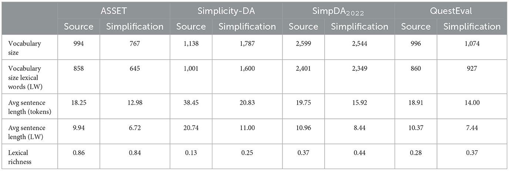
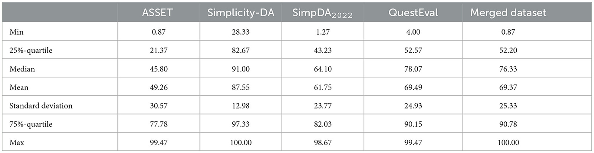

# Repository for the "Continuous Scale Meaning Dataset" Proposed in "[MeaningBERT: Assessing Meaning Preservation Between Sentences](https://www.frontiersin.org/articles/10.3389/frai.2023.1223924/full)"

## About the Dataset

Aggregate statistics on textual data of the four datasets used to create "Continuous Scale Meaning Dataset".


Aggregate statistics on meaning preservation rating data using a continuous scale (0–100) for the four datasets used to
create "Continuous Scale Meaning Dataset".


For more detail, see our article.

## To Cite

```
@ARTICLE{10.3389/frai.2023.1223924,
AUTHOR={Beauchemin, David and Saggion, Horacio and Khoury, Richard},   
TITLE={{MeaningBERT: Assessing Meaning Preservation Between Sentences}},      
JOURNAL={Frontiers in Artificial Intelligence},      
VOLUME={6},           
YEAR={2023},      
URL={https://www.frontiersin.org/articles/10.3389/frai.2023.1223924},       
DOI={10.3389/frai.2023.1223924},      	
ISSN={2624-8212},   
}
```

